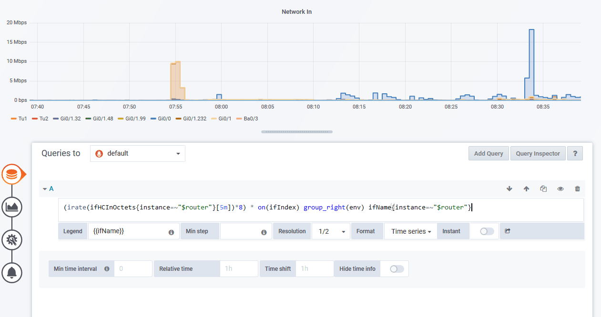

# VictoriaMetrics CI/CD pipeline

Deploy VictoriaMetrics server with CI/CD on Elestio

 
 

# Once deployed ...

You can open VictoriaMetrics UI here:

    URL: https://[CI_CD_DOMAIN]
    email: [ADMIN_EMAIL]
    password: [ADMIN_PASSWORD]

# System Administrator

Your account is set as Tenant Administrator, like that, you will be able to create new customer.
If you want to connect as System Administrator, use these credentials:

    email: admin@[CI_CD_DOMAIN]
    password: [ADMIN_PASSWORD]
